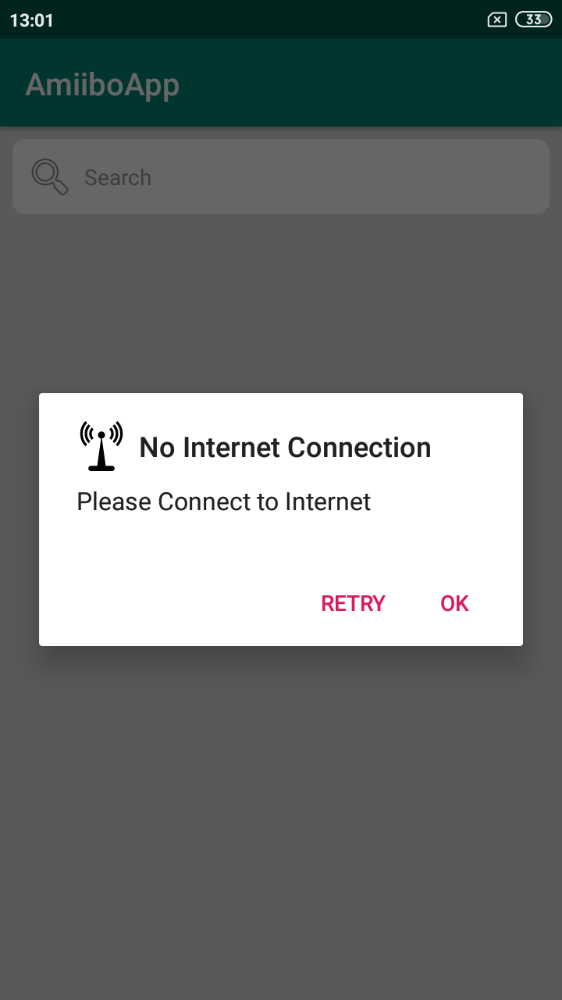
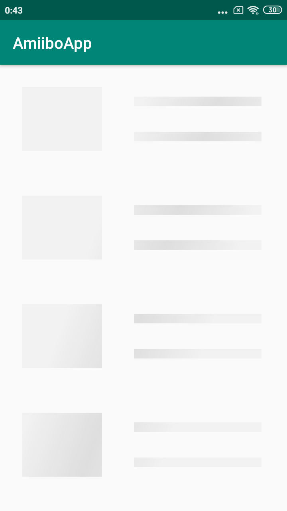
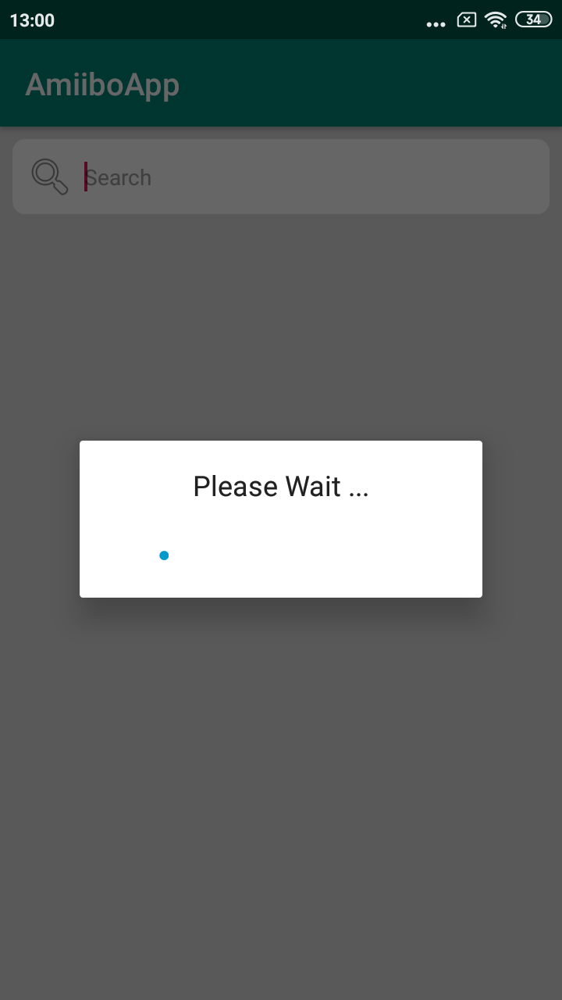

 AmiiboApp
=====

This is an app to demonstrate data fetching from api with help of different networking library, in both Java and Kotlin programming language.

**Api Used :** [Amiibo api](https://www.amiiboapi.com/), An RESTful API for  Amiibo database that holds all amiibo information in a single API.

**Demo Youtube video** link: [https://youtu.be/hwbDVbkpHNw](https://youtu.be/hwbDVbkpHNw)

### Android Networking Library Used:

- **Retrofit Library :** Type-safe HTTP client for Android and Java by Square, Inc. [github project](https://github.com/square/retrofit)

- **Fast Android Networking Library :** A Complete Fast Android Networking Library that also supports HTTP/2. [github project](https://github.com/amitshekhariitbhu/Fast-Android-Networking)

### Screenshot :

<table>
  <tr>
    <td>
      
    </td>
    <td>
      
    </td>
    <td>
      
    </td>
  </tr>
</table>

<table>
  <tr>
    <td>
      
    </td>
    <td>
      
    </td>
    <td>
      
    </td>
  </tr>
</table>

### Project Description

 - Packages : 

   - **java :** This package contain all networking library and other pages code in JAVA programming languages.
 
   - **kotlin :** This package contain all networking library and other pages code in Kotlin programming languages.
 
   - **activity, model, adapter :** These package contain there respective code as by there name.
 
   - **fastNetworking :** This package contain all files that will be used in this library. utils contain Webservice handler and interface which will perform the task of hitting api and fetching JSON data.
   
   - **retrofit :** This package contain all files that will be used in this library. utils contain Client api and Api interface which will perform the task of hitting api and fetching JSON data.
 
 
### Other Library Used :

 * Progress dialog: [SpotsDialog](https://github.com/dybarsky/spots-dialog) and [Shimmer Facebook library](https://github.com/facebook/shimmer-android)
  
 * Image Loading Library : [Bumptech Glide](https://github.com/bumptech/glide)

